# RAG PDF Chat

An end-to-end document question answering system built with Streamlit, LangChain, and FAISS. It solves the common knowledge-base problem of getting fast answers from PDFs without hallucinations, while keeping every response grounded in retrieved source passages.

The app supports persistent multi-PDF ingestion, metadata filtering by document name, and source citations so users can trace each answer back to the original page. It is designed for teams that need reliable document search, research assistance, or internal knowledge discovery over private files.

## Description

**Project Title:** RAG PDF Chat

**The Hook:** A grounded retrieval-augmented generation app that turns a folder of PDFs into a chat-based knowledge base with citations, document filters, and strict anti-hallucination prompting.

**What it solves:** Standard PDF search and naive keyword lookup miss context, while unconstrained LLM answers can invent details. This project solves that by retrieving only relevant chunks from a FAISS vector database, passing them through a strict QA chain, and returning answers with page-level citations.

## Tech Stack

- **Languages:** Python
- **Frameworks:** Streamlit, LangChain
- **Embeddings:** sentence-transformers/all-MiniLM-L6-v2
- **Vector Database:** FAISS
- **Document Processing:** PyPDF, RecursiveCharacterTextSplitter
- **LLMs:** Gemini, OpenAI, AWS Bedrock
- **Packaging:** Docker, Docker Compose
- **Testing:** Pytest

## Why This Architecture

**Problem:** Traditional document search returns snippets but not answers, and RAG systems often fail when they rely on broad context or weak prompting.

**Solution:** This app uses a two-stage pipeline: first, it converts PDFs into chunked embeddings stored in FAISS; second, it retrieves only the most relevant chunks and feeds them into a strict QA prompt that refuses to guess when the evidence is missing.

**Architecture:**

```mermaid
flowchart LR
    A[PDF Uploads / Local PDF Folder] --> B[PDF Parsing & Metadata Enrichment]
    B --> C[Text Splitting]
    C --> D[Embeddings: all-MiniLM-L6-v2]
    D --> E[FAISS Vector Store]
    E --> F[Retriever with Source Filters]
    F --> G[Strict Retrieval QA Prompt]
    G --> H[LLM: Gemini / OpenAI / Bedrock]
    H --> I[Answer + Citations in Streamlit UI]
    I --> J[Chat Export: Markdown / JSON]
```



## Key Features

- Persistent knowledge base stored under `kb_store/` for PDFs and FAISS indexes.
- Metadata filtering so retrieval can be limited to selected source documents.
- Citation-aware answers that expose the original file, page number, and snippet.
- Conversation-aware chat history so follow-up questions stay contextual.
- Multi-provider LLM support for Gemini, OpenAI, and AWS Bedrock.
- Dockerized local deployment with volume-backed persistence.

## Quantitative Results

The repository includes a full automated test suite, and the current validated result is 66 passing tests with a 100% pass rate.

| Metric | Score |
|---|---:|
| Automated tests passing | 66 |
| Pass rate | 100% |
| Core modules covered | 4 |

If you have model-evaluation numbers such as answer accuracy, citation precision, or latency, add them here for the strongest portfolio impact.

## How To Run

### Quick Start

```powershell
python -m venv .venv
.\.venv\Scripts\Activate.ps1
streamlit run app.py
```

### Install Dependencies

Use the included [requirements.txt](requirements.txt) file:

```powershell
pip install -r requirements.txt
```

### Ingest PDFs

```powershell
python ingest.py --pdf-folder data --index-dir faiss_index
```

### Run with Docker

```powershell
docker compose up --build
```

Then open `http://localhost:8501` in your browser.

## Demo

Add a small GIF or screenshot of the Streamlit chat UI here, or include a SageMaker / vector-store dashboard image if you have one. That makes the project feel more concrete to reviewers.

## Notes

- The app persists PDFs in `kb_store/pdfs` and the FAISS index in `kb_store/faiss_index`.
- `rag_core.py` enforces grounded answers and returns `I don't know based on the provided documents.` when the answer is not supported by retrieved context.
- `compose.yaml` mounts the local knowledge base so uploads survive container restarts.

## CI/CD

This repo includes GitHub Actions workflow support for test execution, Docker image build, and deploy automation.

## Configuration

Set your provider credentials in `.env` before running the app.

- Gemini: `GOOGLE_API_KEY`, optional `GEMINI_MODEL`
- OpenAI: `OPENAI_API_KEY`, optional `OPENAI_MODEL`
- Bedrock: AWS credentials, `AWS_REGION`, optional `BEDROCK_MODEL_ID`
